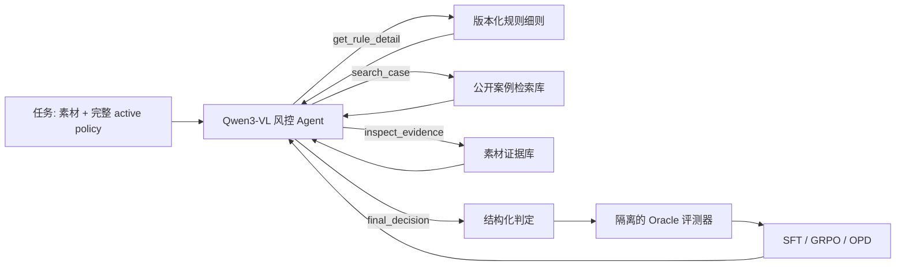

# SingGuard 动态策略 Guard 与多轮内容风控 Agent 设计

**状态：已确认，待实施计划**
**日期：2026-07-13**

## 1. 目标与范围

构建一个可在单张 NVIDIA H20 上训练和评测的内容风控研究环境。项目分为两个不可混淆的 Track：

1. **Track A，SingGuard 机制复现**：无外部工具、无多轮环境。模型在单次调用中直接接收完整 active policy、素材和输出要求，复现运行时策略输入、fast/hybrid/slow 推理、规则命中和结构化证据输出。
2. **Track B，多轮 Agent 增益验证**：模型同样直接接收完整 active policy；仅对需要外部取证的难例，允许在最多三轮内查询规则细节、案例和补充素材证据，再做最终审核判定。

只有在 Track B 明确优于 Track A 的 slow guard 时，才保留 Agent 路径；否则部署动态 policy Guard，不为工具调用增加复杂度。

系统从第一天起支持动态策略，而不是固定风险类目：同一素材在不同 `policy_version` 和生效规则集合下可得到不同结论。首期以“功效夸大”作为最先构建的数据切片和验收切片，但规则与工具协议必须同时支持新增、删除、重写、合并和例外规则。后续只需增加策略包和数据切片，即可扩展至私域引流、低俗/擦边等类目。不以复刻 SingGuard 的论文数据规模、论文指标或完整 DAPO 训练为目标。

## 2. 非目标

- 不训练或重新预训练通用多模态基座。
- 不爬取需登录、受访问控制或含个人账号数据的平台内容。
- 不让 Agent 直接联网、直接修改生产策略或直接执行处罚。
- 不做超过三轮的训练轨迹，也不在首期重复输入全量视频帧。
- 不将自由链式思考作为保存、展示或奖励的证据。

## 3. 实验问题与假设

核心问题：对边界风控素材，受限的多轮外部取证是否能在可接受成本内优于完整 active policy 条件下的单轮 slow guard？

假设：模型在必要时检索案例、补充素材证据和 active policy 的细则后，能够提高规则命中率和白样本精度；工具调用成本约束会抑制无效检索。完整 active policy 不是工具检索的替代对象，而是每个任务一开始就提供的判定边界。

## 4. 系统架构



系统由五个边界清晰的模块构成：

1. **Policy Codex**：规则 YAML，带 `policy_version`、`rule_id`、优先级、例外条款、适用范围和回归样例。
2. **Case Index**：经清洗的公开监管/处罚案例的可检索片段，不含最终标签字段。
3. **Evidence Store**：按素材保存 OCR、ASR、标题、关键帧描述与可选图像；首期支持“虚拟素材”，即从案例重构的证据包。
4. **Agent Environment**：确定性、可复放的工具环境，负责执行动作并追加工具观测。
5. **Oracle Evaluator**：独立保存最终标签、规则 ID、人工证据 ID 和最短充分轨迹，用于奖励与离线评测，绝不提供给工具。

## 5. 任务与工具协议

每条任务包含：`asset_id`、初始素材摘要、完整 active policy、`policy_version`、允许的工具声明和最大轮数 3。任务只针对当前生效规则判定；同一素材可以在不同策略包中拥有不同 oracle 结论。完整 active policy 由系统消息直接注入，不依赖 Agent 先搜索到相关规则。

首期仅开放以下工具：

| 工具 | 输入 | 输出 | 约束 |
|---|---|---|---|
| `get_rule_detail` | `policy_version`, `rule_id` | 当前 active policy 中规则的完整 SOP、例外、来源 ID | 只能展开当前 active policy 已声明的 `rule_id`；不能发现或引入隐藏规则 |
| `search_case` | `query`, `top_k` | 历史案例事实与证据片段、case ID | 不返回处罚结论、人工标签或 oracle 字段 |
| `inspect_evidence` | `asset_id`, `fields` | 指定 OCR、ASR、帧描述/图像和元信息 | 每次仅允许请求白名单字段 |
| `final_decision` | `label`, `rule_id`, `evidence_ids`, `confidence` | 终止状态 | `rule_id` 必须属于当前 policy；证据 ID 必须已被观察 |

Agent 可在任一轮调用 `final_decision`。环境在达到三轮、模型输出截断、非法调用或完成最终动作后终止。Track A 不启用任何工具；其 fast/hybrid/slow 是一次调用内的解码路径，不是多轮 Agent 行为。

最终输出统一为：`label`、`risk_level`、`rule_id`、`policy_version`、`evidence_ids`、`confidence`、`route` 和 `next_action`。不保存自由 CoT；`evidence_ids` 必须能定位至 OCR span、ASR 时间段、帧或案例片段。

## 6. 数据设计与来源治理

数据分为四层，且访问边界不可混淆：

| 层 | 内容 | 可被 Agent 检索 | 用途 |
|---|---|---|---|
| `raw` | 原始公开页面、抓取元数据、URL、时间与内容哈希 | 否 | 可追溯性与再处理 |
| `processed` | 去重、清洗、脱敏后的规则和案例文档 | 是 | 工具检索 |
| `tasks` | 初始素材信息、策略版本和可调用工具 | 是，仅当前任务 | rollout 起点 |
| `oracle` | 最终标签、命中规则、证据金标、最短充分轨迹 | 否 | SFT 标签、奖励和评测 |

公开数据源优先为法规/监管机关网站、公开行政处罚和典型案例。爬取只访问无需登录且允许访问的公开页面，遵守站点条款、robots、限速与来源记录；不绕过验证码、访问控制或采集个人账号数据。

首期素材可用公开案例重构的虚拟素材包完成环境与格式验证；它不能支撑真实商业风控效果结论。任何“优于现有审核”的结论都必须在具有明确授权、脱敏流程和人工终审标签的真实业务 holdout 上报告。训练、验证、测试按案例族、规则语义族、policy transformation 和时间切分，防止同一案例、近重复话术或规则改写泄漏到测试集。

## 7. 训练设计（ms-swift）

框架统一使用 `modelscope/ms-swift`，因为其支持 Qwen3-VL、多模态 SFT、GRPO、自定义奖励、工具调用数据格式和 `MultiTurnScheduler`。首期避免引入第二套 RL 基础设施。

模型与资源配置：

- 参考推理基线：Sing-Guard-2B、Sing-Guard-4B。
- 自训练主模型：Qwen3-VL-4B-Instruct，LoRA 或 QLoRA；首期冻结 ViT。
- 单张 H20：先以 Qwen3-VL-2B 做多轮 GRPO rollout 显存/吞吐 profiling，再决定是否升至 4B；三轮上限、受限图像数量和像素预算。
- 4B 用于单轮 SFT 与 Tool-SFT；只有 profiling 证明稳定后才进入 4B 多轮 GRPO。8B 仅用于 SFT/推理对照。

训练按顺序进行：

1. **A0/A1，推理基线**：原始 Qwen3-VL 单轮与 SingGuard 动态策略 fast/hybrid/slow。
2. **A2，单轮 Rule-Anchored SFT**：完整 active policy + 素材信息直接输出最终结构化判定；训练和测试均包含规则删减、重写、合并、例外、干扰规则和跨策略反事实。
3. **B0，多轮环境 profiling**：Qwen3-VL-2B 在三轮、受限视觉输入和 vLLM rollout 下验证显存、吞吐、超时与格式可用性。
4. **B1，多轮 Tool-SFT**：基于人工确认的专家轨迹学习工具格式、停止时机与证据引用，只针对需要外部取证的难例。
5. **B2，多轮 GRPO**：在封闭环境中优化最终结果与必要检索；先 2B，profiling 通过后尝试 4B。
6. **OPD（可选）**：只在多轮 GRPO 具有稳定正增益后，用强 teacher 对学生实际 rollout 的错误状态做修正，不作为首个 RL 实验。

默认使用完整轨迹计算 loss。首期不压缩历史、也不删除历史多模态内容；若后续引入上下文压缩，必须采用按轮拆分轨迹并将同一终局奖励分配到每条记录的策略。

## 8. 奖励与反投机

GRPO 不使用唯一“最短专家路径”作为奖励，因为多条检索路径都可能充分。奖励分阶段启用：先格式合法性和终局判定，随后才加入规则、充分证据和成本项。初版终局奖励为：

`R = 1.0 * label_correct + 0.6 * rule_correct + 0.4 * evidence_correct + 0.2 * useful_tool - 0.08 * tool_calls - 0.5 * invalid_action`

其中：

- `label_correct`：最终安全/违规及风险等级符合 oracle。
- `rule_correct`：命中当前策略版本中的目标规则；未生效规则不得计分。
- `evidence_correct`：提交的证据 ID 与人工证据集合匹配。
- `useful_tool`：调用结果中包含 oracle 认可的充分证据或必要例外，且不是重复调用；它不要求命中唯一案例或唯一动作顺序。
- `invalid_action`：非法 JSON、未知工具、未观察证据、错误策略版本或不合法 rule ID。

LLM-as-a-Judge 只用于离线误差分析和待人工审核候选，不作为首版主奖励。每个 rollout 记录工具次数、动作序列、token、终局 reward 和失败原因，以识别复制规则标题、过度查询、猜高危标签等投机行为。

## 9. 评测协议与验收

统一对比 Track A 与 Track B，报告整体和按规则/白样本/边界样本/对抗改写/策略版本切片的：

- 最终标签 precision、recall、F1；白样本误伤率。
- 规则 ID exact match；证据 ID precision、recall、F1。
- 平均轮数、平均工具次数、无效调用率、平均 token 与 P95 延迟。
- 人工推翻率与“查询后纠错”的比例。

继续进入多轮 RL 的门槛：Track A2 在动态策略反事实集上首先达到预设 policy-following 门槛。继续进入 4B、更多轮或 OPD 的门槛：Track B 相对于 Track A slow guard，在固定白样本误伤上限内，提高规则 ID/证据指标或最终 F1，且平均工具次数与 P95 延迟处于预设预算之内。

30/60/90 天止损门槛：

- **30 天**：在规则移除、规则加入、规则重写和行业豁免下，动态策略结论正确改变；否则停止 Agent 训练，先修复 Track A。
- **60 天**：Tool-SFT 仅在需要外部案例或补证据的切片上优于 Track A slow guard，且无效调用率可控；否则保留 Guard，移除 Agent 路径。
- **90 天**：多轮 GRPO 相对 Tool-SFT 有稳定增益；若只提高工具次数和延迟、不改善白样本误伤或证据质量，停止 RL。

## 10. 仓库边界

```text
data/raw/          原始公开资料与抓取元数据，不进入训练
data/processed/    清洗后的可检索文档
data/tasks/        rollout 初始任务
data/oracle/       隔离的标签和证据真值
policies/          版本化规则与回归样例
agent_env/         工具、状态机与可复放环境
train/             ms-swift SFT、GRPO、OPD 配置
eval/              统一基线与指标计算
docs/              设计、数据卡和实验记录
```

## 11. 风险与缓解

| 风险 | 缓解 |
|---|---|
| 没有可靠的工具轨迹真值 | 先精标 1k–3k 边界样本；对合成轨迹做人工抽检 |
| 工具检索泄露标签 | oracle 与检索索引物理分目录、字段白名单和测试断言 |
| 多模态上下文占满 H20 显存 | 冻结 ViT、限制帧数/分辨率、按需获取证据、三轮上限 |
| reward hacking | 终局正确、规则、证据、成本和非法动作组合奖励；报告动作分布 |
| 训练/部署协议漂移 | schema、prompt、policy 和工具描述均版本化并做回归测试 |

## 12. 策略与数据切片决策

首期数据切片采用“功效夸大”，因为它具备较丰富的公开规则与监管案例，且能覆盖规则版本、例外条款、OCR/ASR 证据和白样本误伤等核心问题。它不是系统边界：至少应同时构造一小组跨策略反事实任务，使同一素材在“功效夸大策略包”“私域引流策略包”或“行业豁免策略包”中拥有不同的允许规则和预期结论，用于验证动态 policy 跟随能力。
